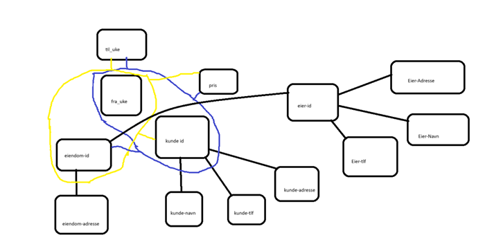

I tillegg er det lagt inn kunde_id, eier_id og eiendoms_id, som entydig identifiserer henholdsvis en person og en eiendom.

### Kandidatnøkler

Foreslåtte kandidatnøkler for denne tabellen (gitt forutsetningene at en person kun kan leie én eiendom av gangen, og at en eiendom kan leies ut til kun én person av gangen):

1. **(kunde_id, fra_uke, til_uke)**
2. **(eiendom_id, fra_uke, til_uke)**
3. **(eier_id, fra_uke, til_uke)**

### Problemområder ved tabellen

- **Redundans av kundedata:**  
  Hvis informasjon skal endres, må det endres flere steder. Dette medfører redundans og øker risikoen for feil ved oppdateringer.

- **Manglende referanseintegritet:**  
  Det finnes ingen klare referanser til andre tabeller. For eksempel, dersom en kunde eller eiendom slettes fra sine respektive tabeller, blir ikke referansene i denne tabellen oppdatert, og man kan ende opp med ugyldige referanser.

- **Inkonsistens ved oppdateringer:**  
  Flere oppdateringssteder fører til at data kan bli inkonsistente dersom oppdateringer ikke gjennomføres korrekt overalt.

- **Manglende historisk informasjon:**  
  Informasjonen blir ikke lagret over tid, noe som kan være problematisk for historiske spørringer og revisjon.

### Diagram over funksjonelle avhengigheter

---

### Foreslått oppsplitting til BCNF

Ved hjelp av funksjonelle avhengigheter og BCNF deles tabellen opp i mindre, mer normaliserte tabeller:

- **Kunde:**  
  `kunde (kunde_id (PK), kunde_navn, kunde_adresse, kunde_tlf)`

- **Eiendom:**  
  `eiendom (eiendom_id (PK), eiendom_adresse)`

- **Eier:**  
  `eier (eier_id (PK), eier_navn, eier_adresse, eier_tlf)`

- **Leieforhold:**  
  `leieforhold (kunde_id, eiendom_id, eier_id (PK), fra_uke, til_uke, pris)`

---

### Normaliseringsprosess (1NF → 2NF → 3NF)

Kan vi løse denne oppgaven ved å gjennomføre prosessen 1NF → 2NF → 3NF?  
**Svar:** Ja, man kan normalisere ved å følge prosessen 1NF → 2NF → 3NF.  
- **1NF (First Normal Form):**  
  Sikrer at hver celle i tabellen inneholder et enkelt, atomisk dataelement (ingen fler- eller sammensatte verdier).

- **2NF (Second Normal Form):**  
  Bygger videre på 1NF og eliminerer delvise funksjonelle avhengigheter ved å dele opp tabellen i separate tabeller, slik at alle attributter er fullt funksjonelt avhengige av primærnøkkelen.

- **3NF (Third Normal Form):**  
  Fjerner transitive funksjonelle avhengigheter, slik at hvert ikke-nøkkelattributt er direkte avhengig av primærnøkkelen.

Hver normaliseringsprosess bidrar til å eliminere redundans og opprettholde dataintegriteten.

---

## DEL 2: Transaksjoner

I denne delen skal du demonstrere transaksjonsstyring i MySQL. Merk at transaksjoner ikke kan skrives i phpMyAdmin; du må bruke MySQL Console eller MySQL Shell.

### Oppsett

1. Velg en MySQL-brukerkonto for tilkobling.
2. Opprett innhold i databasen (evt. slett gammelt innhold med `DELETE FROM konto`).
3. Kjør `konto.sql` eller tilsvarende `CREATE TABLE`-skript fra foilene.

#### Frivillig: Manuell bruk av skrive- og leselåser

For de som ønsker å teste manuell låsing (lese- og skrivelåser), kan dere låse hele tabeller ved hjelp av:
[MySQL Lock Tables Documentation](https://dev.mysql.com/doc/refman/5.7/en/lock-tables.html)

- **Scenario 1:**  
  Én klient setter leselås på `konto`-tabellen.  
  - Kjør `SELECT * FROM konto;` i begge klientene.  
  - Hva skjer?  
  - Kan den andre klienten også sette leselås?  

- **Scenario 2:**  
  Fjern låsene, og prøv følgende:
  - `UPDATE konto SET saldo = 0 WHERE kontonr = 1;` i begge klientene.
  - Forklar resultatet.

- **Scenario 3:**  
  Én klient setter skrivelås på `konto`-tabellen.
  - Kjør `SELECT * FROM konto;` i begge klientene.
  - Lås opp tabellen, sett skrivelås på nytt.
  - Kan den andre klienten sette leselås?
  - Er det mulig å kjøre `UPDATE konto SET saldo = 0 WHERE kontonr = 1;`?
  - Sjekk i begge klienter og forklar svaret.

Husk å fjerne låsene etter testingen!

---

### Transaksjoner

Bruk MySQL-dokumentasjonen for å finne ut hvordan du starter og avslutter en transaksjon. En god start er denne siden:  
[MySQL COMMIT Documentation](https://dev.mysql.com/doc/refman/8.0/en/commit.html)

Test følgende:
- Sjekk innholdet i `konto`-tabellen.
- Start en transaksjon og oppdater en konto.
- Verifiser at `COMMIT` og `ROLLBACK` gir ønsket resultat (kjør transaksjonen to ganger – en gang med commit og en gang med rollback).

---

## Teori om transaksjoner og låser

Svar på følgende spørsmål:

1. **Hvilke typer låser har databasesystemene?**

2. **Hvorfor ønsker man ofte et lavere isolasjonsnivå enn SERIALIZABLE?**

3. **Hva skjer dersom to pågående transaksjoner med isolasjonsnivå SERIALIZABLE prøver `SELECT SUM(saldo) FROM konto`?**

4. **Hva er to-fase-låsing?**

5. **Hvilke typer samtidighetsproblemer kan man få ved ulike isolasjonsnivåer?**  
   Hva er optimistisk låsing/utførelse, og hva kan grunnen til å bruke dette være?

6. **Hvorfor kan det være uheldig med lange transaksjoner?**  
   Vil det være lurt å ha en transaksjon som krever input fra bruker?

---

## Oppgaver om transaksjoner

Når kommandoer for Klient 1 og Klient 2 kjøres samtidig, spiller rekkefølgen ingen rolle.

### Oppgave 1

| **Tid** | **Klient 1**                                      | **Klient 2**                          |
|---------|---------------------------------------------------|---------------------------------------|
| 1       | Sett isolasjonsnivå til **READ UNCOMMITTED**.     | Sett isolasjonsnivå til **SERIALIZABLE**. |
| 2       | Start transaksjon.                                | Start transaksjon.                    |
| 3       |                                                   | `SELECT * FROM konto WHERE kontonr=1;`  |
| 4       | `SELECT * FROM konto WHERE kontonr=1;`             |                                       |
| 5       | `UPDATE konto SET saldo=1 WHERE kontonr=1;`        |                                       |
| 6       |                                                   | `COMMIT;`                             |
| 7       | `COMMIT;`                                         |                                       |

**Spørsmål:**  
Hva skjer og hvorfor? Hva hadde skjedd om Klient 2 hadde brukt et annet isolasjonsnivå?

**Svar:**  
Klient 1 hindres i å fortsette på linje 5 pga. leselås satt av Klient 2. Dersom Klient 2 benytter et annet isolasjonsnivå, ville leselåsen ikke vært etablert, og Klient 1 kunne fullført kjøringen uten å vente.

---

### Oppgave 2

#### a)

| **Tid** | **Klient 1**                                 | **Klient 2**                                 |
|---------|----------------------------------------------|----------------------------------------------|
| 1       | Sett isolasjonsnivå til **READ UNCOMMITTED**.  | Sett isolasjonsnivå til **READ UNCOMMITTED**.  |
| 2       | Start transaksjon.                           | Start transaksjon.                           |
| 3       | `UPDATE konto SET saldo=1 WHERE kontonr=1;`    |                                              |
| 4       |                                              | `UPDATE konto SET saldo=2 WHERE kontonr=1;`    |
| 5       | `UPDATE konto SET saldo=1 WHERE kontonr=2;`    |                                              |
| 6       | **COMMIT;**                                  | `UPDATE konto SET saldo=2 WHERE kontonr=2;`    |
| 7       |                                              | **COMMIT;**                                  |

**Spørsmål:**  
Hva blir resultatet? Hvorfor må det være slik?

**Svar:**  
Klient 2 utfører sine `UPDATE`-setninger sist, slik at endringene fra Klient 2 overskriver de fra Klient 1. Begge operasjonene gjennomføres, men sluttresultatet reflekterer Klient 2s oppdateringer.

#### b)

Her kjøres Klient 2s `UPDATE`-setninger i motsatt rekkefølge:

| **Tid** | **Klient 1**                                 | **Klient 2**                                 |
|---------|----------------------------------------------|----------------------------------------------|
| 1       | Sett isolasjonsnivå til **READ UNCOMMITTED**.  | Sett isolasjonsnivå til **READ UNCOMMITTED**.  |
| 2       | Start transaksjon.                           | Start transaksjon.                           |
| 3       | `UPDATE konto SET saldo=1 WHERE kontonr=1;`    |                                              |
| 4       |                                              | `UPDATE konto SET saldo=2 WHERE kontonr=2;`    |
| 5       | `UPDATE konto SET saldo=1 WHERE kontonr=2;`    |                                              |
| 6       |                                              | `UPDATE konto SET saldo=2 WHERE kontonr=1;`    |
| 7       |                                              |                                              |

**Spørsmål:**  
Hva blir resultatet? Forklar forskjellen fra oppgave (a). Vil det ha noe å si om man endrer isolasjonsnivå på klientene?

**Svar:**  
Resultatet blir en **deadlock**: de to transaksjonene venter på hverandre og blokkerer dermed hverandre. Endring av isolasjonsnivå kan påvirke låseatferden, men i dette tilfellet vil motstridende oppdateringer fremdeles kunne skape en deadlock.

---

### Oppgave 3

| **Tid** | **Klient 1**                                      | **Klient 2**                                      |
|---------|---------------------------------------------------|---------------------------------------------------|
| 1       | Sett isolasjonsnivå til **READ UNCOMMITTED**.     | Sett isolasjonsnivå til **SERIALIZABLE**.         |
| 2       | Start transaksjon.                                | Start transaksjon.                                |
| 3       | `SELECT SUM(saldo) FROM konto;`                   |                                                   |
| 4       |                                                   | `UPDATE konto SET saldo=saldo+10 WHERE kontonr=1;`  |
| 5       | `SELECT SUM(saldo) FROM konto;`                   |                                                   |
| 6       |                                                   | `COMMIT;`                                         |
| 7       | `SELECT SUM(saldo) FROM konto;`                   |                                                   |
| 8       | `COMMIT;`                                         |                                                   |

**Spørsmål:**  
Hva skjer? Hva vil skje om Klient 1 bruker READ COMMITTED, REPEATABLE READ eller SERIALIZABLE?

**Svar:**  
Med Klient 1 på READ UNCOMMITTED vil den ikke nødvendigvis se den oppdaterte verdien fra Klient 2 før den er committet. Ved bruk av SERIALIZABLE vil oppdateringen i Klient 2 ikke kunne utføres før Klient 1 har fullført sin transaksjon, noe som forhindrer uventede endringer under transaksjonen. READ COMMITTED og REPEATABLE READ vil vise samme oppførsel på linje 5, men når Klient 2 commit-er, vil de nye verdiene reflekteres ved påfølgende spørringer.

---

### Oppgave 4: Phantom Reads

**Oppgave:**  
Lag en kjøring med to klienter som tester phantom reads. Her må du vurdere hvilket isolasjonsnivå som er best egnet for å hindre phantom reads. Dersom resultatet ikke er som forventet, sjekk MySQL-dokumentasjonen.

**Svar:**  
Phantom reads oppstår når en transaksjon ser nye rader lagt til av en annen transaksjon etter at den første transaksjonen har startet. Isolasjonsnivåene **REPEATABLE READ** og **SERIALIZABLE** forhindrer vanligvis phantom reads ved å låse hele datasettet som skal leses, slik at ingen nye rader blir synlige før transaksjonen er avsluttet.

---

*Notat:*  
Alle kommandoer og resultater skal testes i to klienter (eller to konsoller på samme maskin). Dette dokumentet viser kun teoretiske eksempler og svar på oppgavene.

---

## Avslutning

Denne øvingen dekker både normalisering og transaksjoner, og hjelper deg å forstå:
- Hvordan tabeller kan splittes opp i mindre deler for å unngå redundans og sikre referanseintegritet.
- Hvordan transaksjoner og låser fungerer i MySQL, og hvordan ulike isolasjonsnivåer påvirker samtidige operasjoner.

Lykke til med innleveringen!
