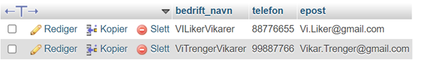
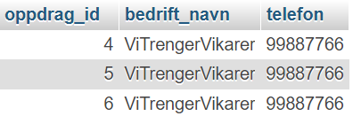
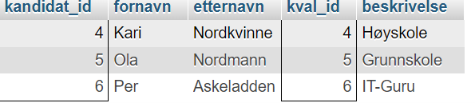
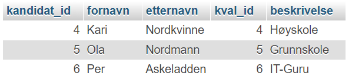

Resultater Øving 5

oppdrag(oppdrag_id, planlagt_startdato, planlagt_sluttdato, planlagt_ant_timer, virkelig_startdato, virkelig_sluttdato, virkelig_antall_timer, sluttattest, bedrift_id\*, kval_id\*, kandidat_id\*)

kvalifikasjon(kval_id, beskrivelse)

vikartjeneste(org_nr, navn, adresse, telefon, epost)

bedrift(org_nr, bedrift_navn, telefon, epost)

kandidat(kandidat_id, fornavn, etternavn, telefon, epost)

kval_kandidat(kval_id\*, kand_id\*)

1) Lag en liste over alle bedriftene. Navn, telefon og epost til bedriften skal skrives ut.

SELECT bedrift_navn, telefon, epost FROM bedrift;

\-- 2) Lag en liste over alle oppdragene. Om hvert oppdrag skal du skrive ut oppdragets nummer, samt navn og telefonnummer til bedriften som tilbyr oppdraget.

SELECT o.oppdrag_id, b.bedrift_navn, b.telefon FROM oppdrag o, bedrift b WHERE o.bedrift_id = b.org_nr;

3) Lag en liste over kandidater og kvalifikasjoner. Kandidatnavn og kvalifikasjonsbeskrivelse skal med i utskriften. I tillegg til løpenumrene som identifiserer kandidat og kvalifikasjon.

SELECT k.kandidat_id, k.fornavn, k.etternavn, kv.kval_id, kv.beskrivelse FROM kandidat k, kval_kandidat, kvalifikasjon kv WHERE k.kandidat_id = kval_kandidat.kandidat_id AND kv.kval_id = kval_kandidat.kval_id;

4) Som oppgave 3), men få med de kandidatene som ikke er registrert med kvalifikasjoner.

SELECT k.kandidat_id, k.fornavn, k.etternavn, kv.kval_id, kv.beskrivelse FROM kandidat k LEFT JOIN kval_kandidat kk ON (k.kandidat_id = kk.kandidat_id) LEFT JOIN kvalifikasjon kv ON(kv.kval_id = kk.kval_id);

5) Skriv ut jobbhistorikken til en bestemt vikar, gitt kandidatnr. Vikarnavn, sluttattest, sluttdato, oppdragsnr og bedriftsnavn skal med. Sluttattesten er en standardtekst der data ang. dette oppdraget fylles inn.

SELECT k.fornavn, k.etternavn, o.virkelig_sluttdato, o.oppdrag_id, b.bedrift_navn FROM kandidat k, oppdrag o, bedrift b WHERE k.kandidat_id = 2 AND k.kandidat_id = o.kandidat_id AND o.bedrift_id = b.org_nr;

 Tomt resultat