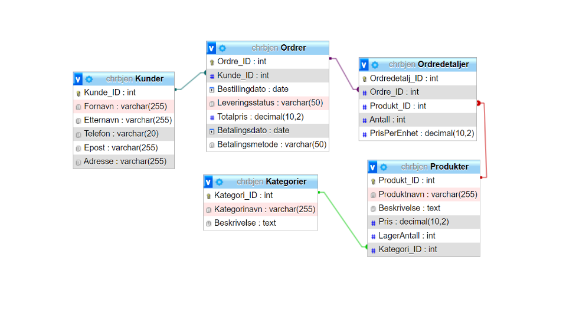

# 1. Krav til innlevering

```
Under følger beskrivelse av minimumskrav til besvarelsen.
```
## 1.1. Definere behov

```
Beskriv kort (maks. en side) eget case/egen problemstilling og klargjør målene for lagring og
representasjon av data knyttet til case-en. Hva ønsker du å oppnå? Finnes det begrensninger i
hva som er mulig å oppnå?
Egen case kan her f.eks. hentes fra en tenkt/fiktiv jobbsituasjon eller fra fritid/hobby.
```
## Vår case:
```
Casen vi har bestemt oss for er å lage en databaseløsning for en klesbedrift. Uten
databaseløsningen sliter klesbedriften med å holde kontroll over lagerstatusen i sanntid, noe
som fører til at de bestiller for mye eller for lite av forskjellige varer. Et annet problem er at
det tar alt for lang tid for kundeservice å finne relevant informasjon om kunders ordrestatus
og leveringsdetaljer. Derfor er det viktig for denne bedriften å innføre en god databaseløsning
hvor relevant informasjon blir lagret på en oversiktlig måte.
Målene vår for lagring og representasjon av data inkluderer dataintegritet, skalerbarhet, og
effektiv datatilgang. For å kunne oppnå god dataintegritet tenker vi å implementere primær-
og fremmednøkler slik at referanseintegriteten mellom tabellene blir opprettholdt. For
skalerbarhet er det viktig å velge en databaseløsning som kan håndtere økende belastning og
hvor vi kan partisjonere dataen. I denne øvingen bruker vi mySQL, men det er fordi det er den
vi har mest kjennskap til. Til slutt vil vi optimalisere spørringene våre slik at vi får tak i
dataen på en mer effektiv måte. Dette vil vi gjøre gjennom å f.eks. bruke OUTER JOIN og
INNER JOIN i spørringene våre hvor dette er relevant. Gjennom å bruke JOIN spørringer kan
du hente ut informasjon fra flere tabeller samtidig, noe som øker hvor mye informasjon vi kan
få ut fra hver spørring. Da slipper vi å skrive flere spørringer enn vi trenger.
Det finnes flere begrensinger som klesbedriften må tenke på når de skal implementere
databaseløsningen. Hardwarekapasiteten kan begrense hvor god databaseløsningen fungerer.
Hvis bedriften får mange spørringer og transaksjoner på en gang kan det hende at serverens
CPU og RAM ikke klarer å håndtere det, noe som fører til forsinkelser og dårligere ytelse.
Begrensninger i lagringsplass kan forekomme på grunn av at store datasett krever betydelige
investeringer i lagringsinfrastrukturen.

Det er ikke alltid like lett å skrive optimaliserte spørringer som sørger for høyest mulig
effektivitet, spesielt når det er snakk om kompliserte spørringer. Dette kan også føre til
dårligere ytelse enn forventet.
Uansett om det er noen begrensninger når det kommer til denne databaseløsningen, vil
implementasjonen fortsatt bety at klesbedriften vil kunne hente ut relevant kunde- og
ordreinformasjon og holde styr på lagerbeholdningen sin på en mye raskere og oversiktlig
måte.
```
## 1.2. Egen relasjonsdatabase med eksempler i SQL

```
Besvarelsen skal inneholde noen praktiske eksempler relatert til case-en med et forslag om en
konkret databaseløsning i SQL. Tegn evt. et ER-diagram (men dette er ikke et krav på denne
øvinga).
Det er mest nærliggende å vise praktiske eksempler i MySQL siden det databasesystemet
brukes i faget, men andre SQL-databasesystem (RDBMS) kan også brukes (på eget ansvar).
Minimumskrav til databaseløsning:

- Databasen må inneholde minst 4 tabeller/relasjoner og sammenhenger (eng.
    relationships) mellom disse.
- Primær- og fremmednøkler skal være definert. Det er ikke et absolutt krav at
    databasen skal implementeres (dvs. ikke krav om CREATE TABLE-setninger)
    så lenge du skisserer hvordan databasen vil se ut.
- Vis minst 3 eksempler på (SQL-)spørringer mot minst to tabeller/relasjoner,
    dvs. vis eksempel på forening/"joining" av flere tabeller, ikke bare spørringer
    mot en tabell.
- Ha en kort oppsummering til slutt om erfaringer ved bruk av
    databaseløsningen, inkludert hvor lett det var å skrive spørringene mot den.
    Evt. kort om forslag til videre arbeid. Hva kunne ha vært gjort om du skulle ha
    jobbet videre med oppgaven?
```


## Relasjonstabell:

```
Kunder (Kunde_ID, Fornavn, Etternavn, Telefon, Epost, Adresse)

Produkter (Produkt_ID, Produktnavn, Beskrivelse, Pris, LagerAntall, Kategori_ID*)

Kategorier (Kategori_ID, Kategorinavn, Beskrivelse)

Ordrer (Ordre_ID, Kunde_ID*, Bestillingdato, Leveringsstatus, Totalpris, Betalingsdato,
Betalingsmetode)

Ordredetaljer (Ordredetalj_ID, Ordre_ID*, Produkt_ID*, Antall, PrisPerEnhet)

```

## Databaseløsningen:



## Spørringer:

### Denne henter ut all informasjon om ordrer:
``` sql
SELECT Ordrer.Ordre_ID, Ordrer.Bestillingdato, Ordrer.Totalpris,
Kunder.Fornavn, Kunder.Etternavn, Kunder.Adresse
FROM Ordrer
INNER JOIN Kunder ON Ordrer.Kunde_ID = Kunder.Kunde_ID;
```

### Henter ut en detaljert liste over hva hver ordre inneholder:
``` sql
SELECT Ordrer.Ordre_ID, Produkter.Produktnavn, Produkter.Beskrivelse,
Ordredetaljer.Antall, Ordredetaljer.PrisPerEnhet
FROM Ordrer
INNER JOIN Ordredetaljer ON Ordrer.Ordre_ID = Ordredetaljer.Ordre_ID
INNER JOIN Produkter ON Ordredetaljer.Produkt_ID = Produkter.Produkt_ID;
```

### Denne spørringen viser produkter og deres kategoriinformasjon:
``` sql
SELECT Produkter.Produktnavn, Produkter.Pris, Kategorier.Kategorinavn,
Kategorier.Beskrivelse
FROM Produkter
INNER JOIN Kategorier ON Produkter.Kategori_ID = Kategorier.Kategori_ID;
```

### Denne spørringen lister opp kunder og deres ordrer sortert etter totalpris:
``` sql
SELECT Kunder.Fornavn, Kunder.Etternavn, Ordrer.Ordre_ID, Ordrer.Totalpris
FROM Kunder
INNER JOIN Ordrer ON Kunder.Kunde_ID = Ordrer.Kunde_ID
ORDER BY Ordrer.Totalpris DESC;
```
## Oppsummering:

```
Denne databaseløsningen gjør at all kunde- og ordreinformasjon er oversiktlig lagret og det er
ikke veldig vanskelig å skrive gode spørringer som gir ut den relevante informasjonen.
Gjennom å gjøre databasen på tredje normalform vil det unngå unødvendig redundans og
sikre dataintegriteten gjennom god struktur og avhengigheter. Dette gjør at det er enklere å
vedlikeholde og skalere databasen. Hvis vi skulle arbeidet videre med databasen ville vi ha
laget flere relevante spørringer og prøve å finjustere spørringene for å forbedre ytelsen
ytterligere.
```
## 1.3. Løsning med XML evt. JSON i MySQL

### Denne oppgaven er knyttet til lærestoffet om lagring av semistrukturelle data.

### Vis minst ett eksempel på mulig bruk av XML eller JSON (velg en av dem) i tabellene dine i Oppg. 1.2. Dvs. endre eller legg til attributt(er) i minst en tabell slik at noe data lagres (representeres) som XML eller JSON fortrinnsvis i MySQL (annet RDBMS godtas).

``` sql
ALTER TABLE Kunder
MODIFY Adresse JSON;

INSERT INTO Kunder (Kunde_ID, Fornavn, Etternavn, Telefon, Epost, Adresse)
VALUES
( 101 , 'Ola', 'Nordmann', '12345678', 'ola.nordmann@example.com', '{"gate":
"Bakkeveien 1", "postnummer": "1234", "by": "Oslo", "land": "Norge"}'),
( 102 , 'Kari', 'Nordkvinne', '87654321', 'kari.nordkvinne@example.com',
'{"gate": "Fjellgata 2", "postnummer": "4321", "by": "Stavanger", "land":
"Norge"}');
( 103 , 'Per', 'Persen', '98765432', 'per.persen@example.com', '{"gate":
"Elvegata 12", "postnummer": "5003", "by": "Bergen", "land": "Norge"}');
```

### Vis i tillegg ett eksempel på en SELECT-spørring som henter ut data representert som XML eller JSON.

### Denne spørringen vil hente fullt navn og enkelte deler av adressen som gate og by:
``` sql
SELECT
Fornavn,
Etternavn,
JSON_EXTRACT(Adresse, '$.gate') AS Gate,
JSON_EXTRACT(Adresse, '$.by') AS Byer
FROM Kunder;
```

### Nevn kort med tekst noen fordeler evt. ulemper med å lagre alle eller noen av dataene idatabasen din i oppgave 1.2 som XML alternativt JSON.

```
Fordelene med å bruke JSON for å lagre dataen er at det er fleksibelt og lett å utvide. JSON
tillater semi-strukturerte dataformater og gir derfor større fleksibilitet til å håndtere ulike typer
data uten at man måtte endre database-skjemaet hver gang. JSON bidrar til enklere integrering
av eksterne systemer, siden JSON er ofte brukt i datautveksling mellom ulike systemer og
teknologi.
Ulempene med JSON er at spørringer mot JSON-data er som oftest mer kompleks, noe som
fører til at de kan være tregere enn vanlige SQL-spørringer. Dette kan føre til tregere og
dårligere ytelse ved spesielt store datamengder. Hvis man skal lagre data som JSON vil det
ofte ta opp mer lagringsplass og redundans en det som er strengt tatt nødvendig. Grunnen er at
JSON-formatet inneholder i tillegg nøkkel- eller tag-navn sammen med dataene.
```

## 1.4. NoSQL-løsning (øving 7)

```
Denne deloppgaven erstatter pr. i dag øving 7 om NoSQL. PS! Det kommer ikke spørsmål om
MongoDB på eksamen. For generelt om NoSQL jf. tilleggslitteratur i pensum. Den norske
læreboka nevner ikke NoSQL.
```

### Hvor godt egnet du tror generelt en NoSQL-løsning kan være som et alternativ til relasjonsdatabasen din i oppg. 1.2 (og oppg. 1.3).

```
NoSQL har noen fordeler og ulemper i forhold til relasjonsmodellen vi bruker i vår database.
La oss vurdere de forskjellige aspektene før vi vurderer om NoSQL er godt egnet som en
løsning.
NoSQL-databaser er ofte mer skalerbare enn relasjonsdatabaser, og de kan håndtere store
mengder data og trafikk effektivt. Dette kan være nyttig hvis du forventer høyt volum av
kunder, produkter eller ordrer. Det kan være smart å ha dette i bakhodet for fremtiden, særlig
hvis etterspørselen i butikken øker og vi trenger mer lagerkapasitet for å tilfredsstille kundene.
I tillegg kan NoSQL-løsninger noen ganger kreve mer arbeid for å opprettholde dataintegritet
og konsistens, ettersom de ofte mangler transaksjoner og nøkkelbegrensninger som relasjonsdatabaser tilbyr. I en klesbutikk hvor relasjonsdatabasen fungerer godt, kan dette gi unødvendig kompleksitet.

Dessuten gir relasjonsdatabaser sterk dataintegritet og konsistens. NoSQL-databaser gir mer
fleksibilitet, men krever at du håndterer integritet og konsistens på applikasjonsnivå. Dette
kan føre til unødvendig kompleksitet og gjøre det vanskeligere å opprettholde datakvalitet.

Når vi vurderer de ulike aspektene av NoSQL-løsninger, ser vi at de har sine styrker og
svakheter i forhold til relasjonsdatabaser. Skalerbarheten og evnen til å håndtere store
mengder data og trafikk effektivt er klare styrker for NoSQL, spesielt hvis bedriften forventer
økende pågang fra kunder eller økt antall produkter og ordrer.

Samtidig bør vi være oppmerksomme på at NoSQL-løsninger kan mangle den strenge
dataintegriteten og konsistensen som relasjonsdatabaser tilbyr. Dette kan føre til ekstra
utfordringer og potensielle feil i håndteringen av data, spesielt i et komplekst miljø som en
klesbutikk med mange produkter og kunder. Derfor må bedriften vurdere om den er forberedt
på å håndtere disse utfordringene på applikasjonsnivå og utvikle løsninger som sikrer
dataintegritet og konsistens.
```

### Hvor bra tror du MongoDB (generelt dokumentdatabase (Document-oriented Database)) er egnet som et alternativ?

```
MongoDB lar deg lagre data i et fleksibelt, ustrukturert format. Dette gjøres i BSON noe som
ligner på et JSON format. Men selvom det internt blir lagret i BSON format kan man lagre og
hente ut info i JSON format. Slik blir det enkelt å tilpasse og endre datamodellen over tid uten
å endre skjemaer.

Videre kan også MongoDB skaleres horisontalt ved hjelp av sharding, noe som gjør det godt
egnet for håndtering av store mengder data og økende trafikk. Kort forklart er sharding en
metode for å dele opp data i mindre og mer håndterbare data som kalles “shards”.

I tillegg så er MongoDBs dokumentbaserte modell godt egnet for datatyper med varierende
strukturer, som kunde- og produktdata. Dokumenter kan inneholde innebygde dokumenter og
arrays, noe som gir mer naturlige datarepresentasjoner.

På den andre siden så vil vi ha god referanseintegritetskontroller og
fremmednøkkelbegrensninger, noe som MongoDB mangler. I relasjonsdatabasen vil
fremmednøkkelbegrensning forhindre at en ordre peker til en kunde-ID som ikke eksisterer i
kunder-tabellen. Mens MongoDB tillater derimot at en ordre kan ha en kunde-ID som ikke
finnes i noen kunde-dokument. I tillegg så er det ingen automatiske handlinger ved endring av
data. Så i en relasjonsdatabase kan handlinger som sletting av en kunde-ID i kunder-tabellen
utløse tilsvarende endringer i andre tabeller for å sikre dataintegritet. MongoDB støtter ikke
slike automatiske handlinger, så endringer i ett dokument påvirker ikke automatisk tilhørende
data i andre dokumenter.

På grunn av disse forskjellene kan data bli inkonsistente eller fragmenterte i MongoDB hvis
det ikke er implementert riktig validering og håndtering i applikasjonslaget. Det er viktig å
være oppmerksom på disse utfordringene når man velger MongoDB som databaseløsning.

```

